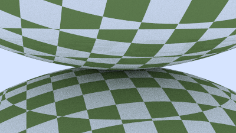
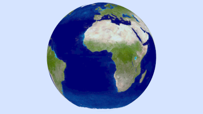
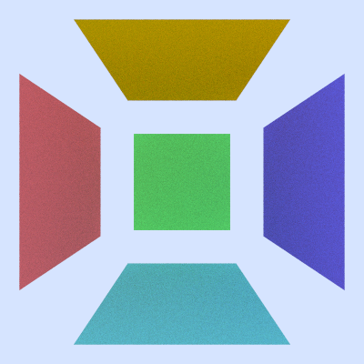
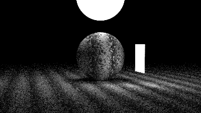
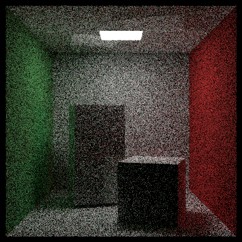
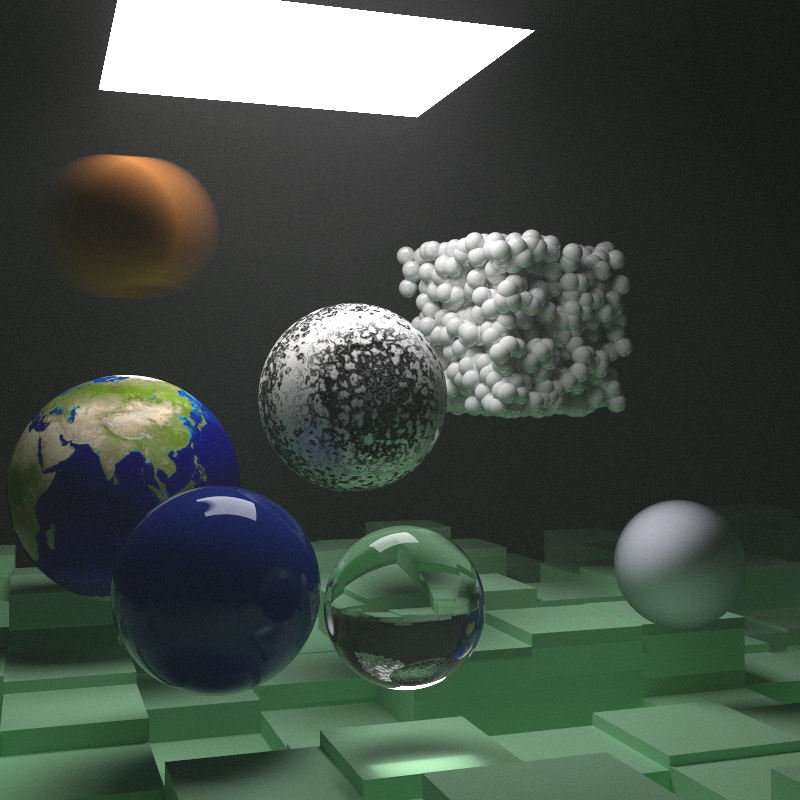
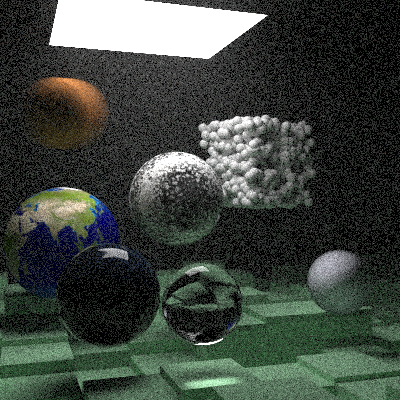

## Ray tracing the next week by C++

### 运行：
```shell
mkdir build
./run.sh
```
通过修改``run.sh``中的参数选择需要渲染的场景。运行完成后结果默认存储在``/build/image.ppm``中。  
### 示例结果：  
> 实际结果与[Ray Tracing: The Next Week](https://raytracing.github.io/books/RayTracingTheNextWeek.html)内的展示结果有些许不同。  
#### 动态模糊:
    
#### 网格纹理:  
  
#### 纹理贴图:  
  
#### perlin noise 纹理:  
  
#### 四边形:  
  
#### 自发光物体:  
  
#### 基础Cornel Box:  
  
#### 烟雾材质Cornel Box:  
  
#### 最终场景(高分辨率):  
> 该场景内由多个小球组成的正方体中，部分小球上好像存在小的凸起，导致该问题的原因还未找到。
  
#### 最终场景(低分辨率):  
